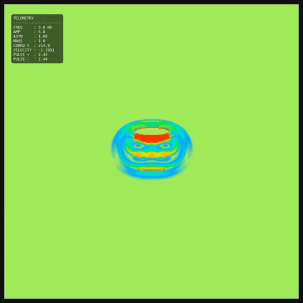

# Aeroacoustic Flying Saucer Oscillating Resonator CFD Simulation (LBM)

## Demo

  

This repository contains a Computational Fluid Dynamics (CFD) simulation application built with Python, NumPy, and Gradio. The application simulates the unsteady fluid dynamics and vortex generation produced by an asymmetric oscillating body (biomimetic resonator / "flying saucer" model) operating in a viscous medium, utilizing the **Lattice Boltzmann Method (D2Q9 model)**.

## Scientific Foundation & Engine Physics

The simulation is mathematically and physically grounded in the experimental and theoretical research of asymmetric vibration dynamics in fluid media.

### 1. The Phenomenon of Anomalous Aerodynamic Drag
The core operational principle relies on the non-linear effects of unsteady fluid dynamics investigated by S.A. Gerasimov (2008). 
* **Dynamic Boundary Layer Modification:** When a plate or asymmetric body undergoes rapid, high-frequency oscillations, the aerodynamic drag coefficient ($C_d$) increases dramatically—reaching values up to $\approx 6.5$, compared to the steady-state value of just $1.1$ in uniform wind tunnel flows.
* **Added Mass Interaction:** This anomalous drag multiplication is caused by the heavy involvement of the fluid's **added mass** ($M_{added}$). The rapid directional shifts of the boundary layer trap and accelerate the surrounding medium, creating highly localized pressure gradients.

### 2. Direction of Motion & Vortex-Oscillatory Thrust
Contrary to classical intuition regarding symmetric mass expulsion, an asymmetric vibrating body generates directed propulsion through **medium management**  (Kandyba, 2025):
* **Vortex Ring Formation:** During the cycle of high-acceleration oscillation, the asymmetric geometry separates the fluid flow unevenly, generating coherent toroidal vortex structures (vortex rings).
* **Pressure Drop Generation:** These vortices act as a collapse of low-pressure zones with the release of free thermal energy of the environment in the form of self-organization of Brownian motion. By controlling the velocity profile asymmetry (the wave acceleration profile), the resonator creates a sustained pressure differential ($\Delta P$) between its upper and lower surfaces, producing a clean net thrust vector without requiring traditional open-loop propellant ejection.
* **Simulation:** The solution represents an empirical simplified model – by accumulating the resistance energy from the oscillations and releasing it as a force in the opposite direction in the next half-cycle. This allows for a fairly realistic visualization of the experimentally observed phenomenon.
 
### 3. Macro-Analogue to Quantum Hydrodynamics
In advanced theoretical frameworks, this mechanism is modeled as a macroscopic analogue to an elementary particle interacting with a non-empty vacuum substrate. By manipulating the local boundary layers and vortex filaments, the craft transitions from "expelling mass" to "modifying the medium geometry," representing a biomechanically inspired step toward advanced propulsion.

---

## 📖 Bibliography & Research Materials

### Scientific Papers & Patents
* **Zenodo Publication (2025):** [Multimodal Aeroacoustic Aircraft Based on an Oscillating Resonator: From Laboratory Models to Quantum-Hydrodynamic Propulsion](https://doi.org/10.5281/zenodo.18047657)
* **Logos Online Journal (2021):** [Flying Saucer Experimental Research, Aerodynamics Unexplored Phenomenon and Bird's Flight](https://doi.org/10.36074/2663-4139.17.01)
* **Patent Reference:** Lozovsky L. (1998). *Method of vehicle movement and a universal "vibroplane" device for its implementation.* Patent RU 2147786 C1.

### Video Demonstrations & Experiments
* **Official YouTube Channel:** [Prometheus Aerospace (Experiments & Prototypes)](https://youtube.com/@prometheusaerospace505?si=OhGW_niCoRLgxGfs)

---

## 🛠️ App Features & Controls

The simulated Python application allows you to tweak the physical parameters of the fluid and the vehicle in real-time via a **Gradio Web UI**:

* **Fluid Properties:** Adjust grid relaxation time ($\tau$), modifying fluid viscosity and Reynolds number dynamics.
* **Object Mass:** Scale the inertia of the body to observe how it handles buoyancy vs. acceleration forces.
* **Dynamic Waveform Editor:** * *Frequency (Hz)* & *Oscillation Amplitude* control the kinematics of the resonator.
  * *Velocity Profile Asymmetry* changes the stroke acceleration bias to optimize thrust generation.
* **Visualization Modes:** Toggle between Velocity Magnitude mapping and Vorticity fields using a professional high-contrast multi-color CFD palette.

